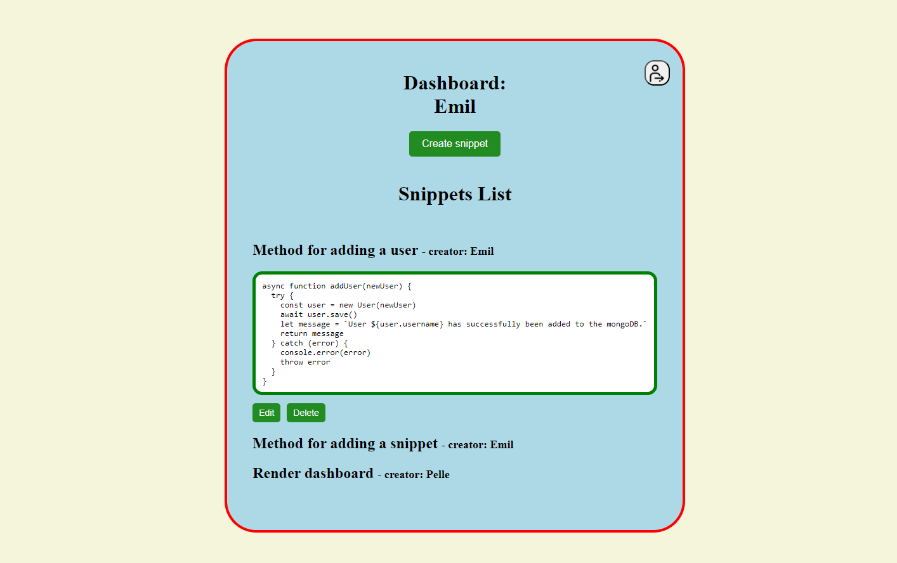

# Crud application for code snippets

This application is built on using mongoDB to store users and snippets.

Firstly, make sure you have Git and npm properly installed. Start by cloning this repo. Once the repository is cloned, locate Git Bash (or similar) into the cloned folder. Enter "npm install" to install the npm package manager. This will also install all the dependencies necessary.
Using Docker and mongoDB is a prerequisite, so it is assumed that the DB is installed, up and running. For example by:

- Start Docker daemon
- Run "docker-compose build"
- Run "docker-compose up -d" (runs it in the background)

When the DB is running and accessible, please enter "npm start" into Git Bash (or similar).
The application will the be available at: http://localhost:3000/

Don´t forget to shut it down:
- Run "docker-compose down"
